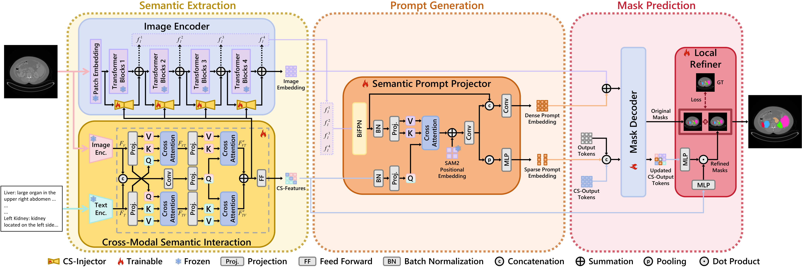
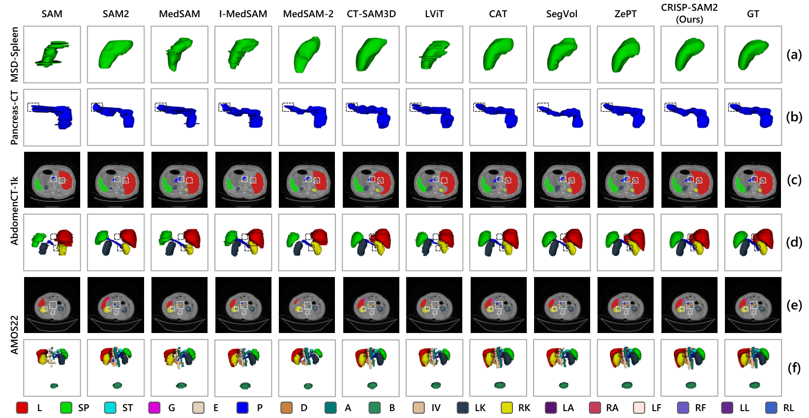
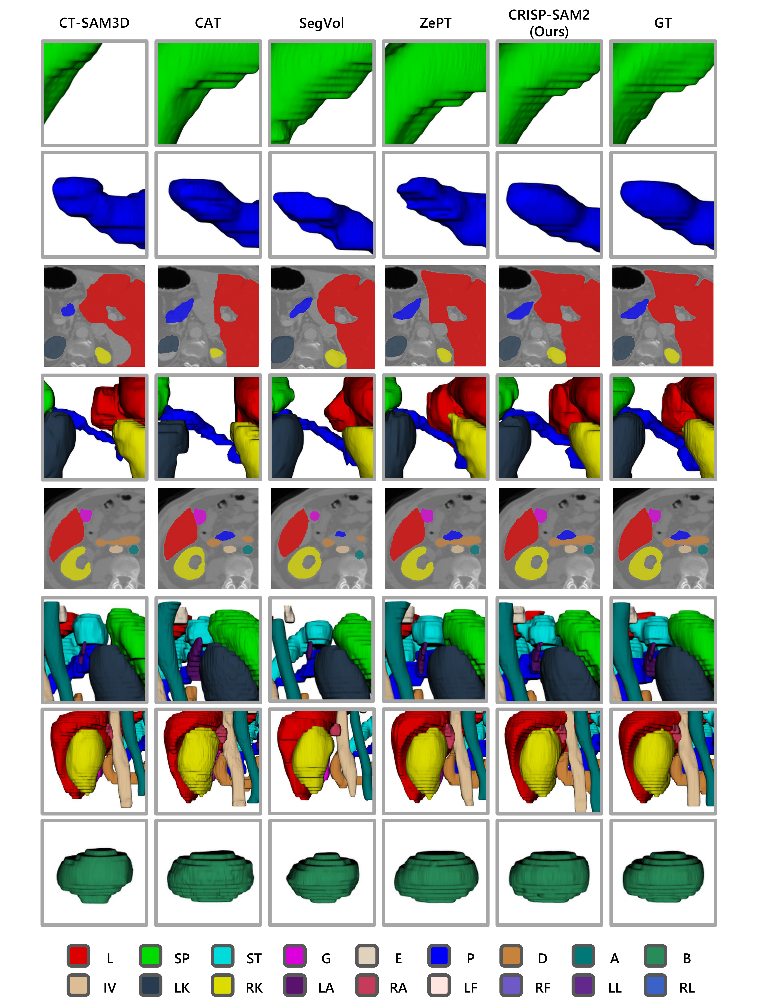

# (ACM MM 25) CRISP-SAM2 : SAM2 with Cross-Modal Interaction and Semantic Prompting for Multi-Organ Segmentation
#### Xinlei Yu 1, Changmiao Wang 2, Hui Jin 1, Ahmed Elazab 3, Gangyong Jia 1, Xiang Wan 2, Changqing Zou 4, Ruiquan Ge 1
#### 1 Hangzhou Dianzi University, 2 Shenzhen Research Institute of Big Data, 3 Shenzhen University, 4 Zhejiang University

 
## 🌟Overview



## 🛠️ Quick Start
## Installation
It is highly recommended to employ a virtual environment with Python >= 3.10, Pytorch >= 2.5.1 and corresponding CUDA.
```
cd CRISP-SAM2
conda env create -f env_config.yml
conda activate CRISP_SAM2
```


## Dataset Preparation
- ### Visual Inputs
| Datasets     | Links                                                                                                                                                   |
|--------------|---------------------------------------------------------------------------------------------------------------------------------------------------------|
| M3D-Seg      | https://github.com/BAAIDCAI/M3D/<br/>https://huggingface.co/datasets/GoodBaiBai88/M3D-Seg/<br/>https://www.modelscope.cn/datasets/GoodBaiBai88/M3D-Seg/ |
| MSD-Spleen   | http://medicaldecathlon.com/                                                                                                                            |
| Pancreas-CT  | https://wiki.cancerimagingarchive.net/display/public/pancreas-ct/                                                                                       |
| LUNA16       | https://luna16.grand-challenge.org/Data/                                                                                                                |
| AbdomenCT-1k | https://github.com/JunMa11/AbdomenCT-1K/                                                                                                                |
| WORD         | https://paperswithcode.com/dataset/word/                                                                                                                |
| FLARE22      | https://flare22.grand-challenge.org/                                                                                                                    |
| AMOS22       | https://amos22.grand-challenge.org/                                                                                                                     |

- ### Textual Inputs
The descriptive definitions and descriptions are stored in 'term_dictionary.json', and compared to the original M3D-Seg joint dataset, we add supplementary sentences. Here, the dictionary can be expanded arbitrarily as required.

## Train & Test
- ### Training process
We highly recommend that the whole training process should be conducted on at least 8 A100-80G GPUs.
```
bash scripts/train.sh
```
- ### Test process
```
bash scripts/test.sh
```


## Visualization
We provide comprehensive visualization utils, including 2D, 3D and local area visualization.




## Citation
If you have any questions about this work, please feel free to contact me at: xinleiyu88@gmail.com. And if you want to cite us, please add this in your paper:
```
@article{yu2025crisp,
  title={CRISP-SAM2: SAM2 with Cross-Modal Interaction and Semantic Prompting for Multi-Organ Segmentation},
  author={Yu, Xinlei and Wang, Changmiao and Jin, Hui and Elazab, Ahmed and Jia, Gangyong and Wan, Xiang and Zou, Changqing and Ge, Ruiquan},
  journal={arXiv preprint arXiv:2506.23121},
  year={2025}
}
```